# Exploratory Data Analysis (EDA) Report

## Project Overview

This report summarizes the exploratory data analysis performed on the Smart MCQ Solver dataset. The objective of the EDA was to understand the dataset structure, analyze text characteristics, inspect answer distributions, and evaluate whether simple semantic similarity methods (TF-IDF and Word2Vec) are effective for ranking the correct answer.

---

# Dataset Exploration

The following preprocessing and exploratory steps were completed:

* Loaded and validated the training and test datasets.
* Checked for missing values and handled empty text fields.
* Cleaned text data for consistent processing.
* Generated text-length features.
* Explored vocabulary distributions.
* Visualized answer label distribution.
* Evaluated semantic similarity between prompts and answer options.
* Compared baseline ranking strategies with similarity-based approaches.

---

# Visualizations

## 1. Answer Distribution

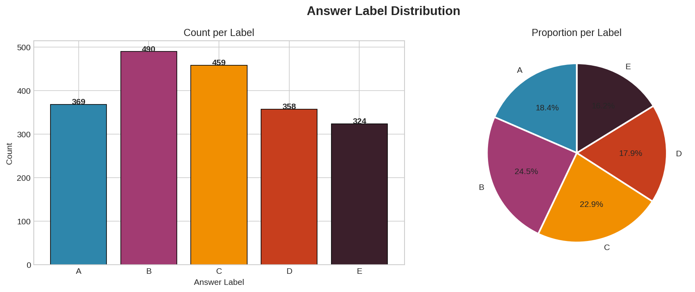

**Observation**

* Correct answer labels are not perfectly balanced.
* **B** is the most frequent answer, followed by **C**, **A**, **D**, and **E**.
* The distribution is only mildly imbalanced and does not indicate severe class skew.

---

## 2. Inter-Option Similarity Heatmap

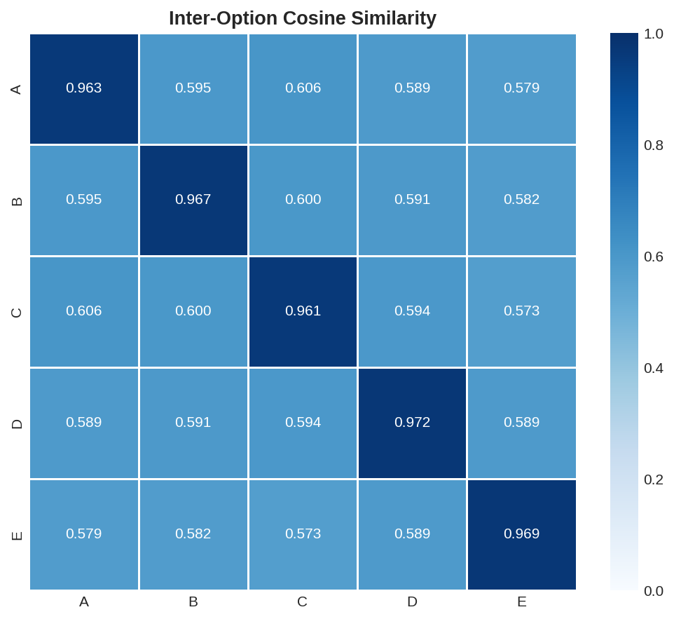

**Observation**

* Displays cosine similarity between answer option texts.
* Diagonal values are close to **1.0**, indicating self-similarity.
* Off-diagonal similarities (~0.58–0.61) show that different answer options often share similar vocabulary.

---

## 3. MAP@3 Comparison

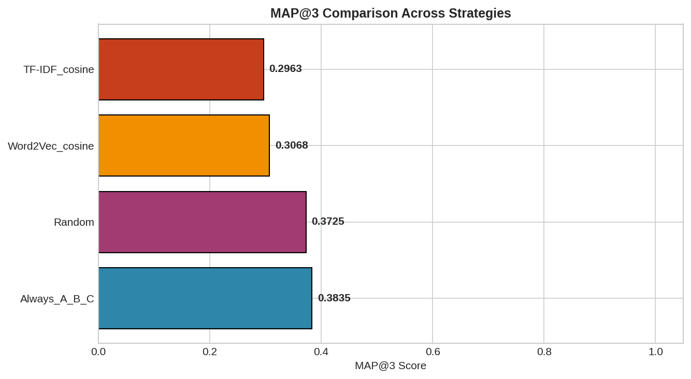

**Observation**

* Compares different ranking strategies using the MAP@3 metric.
* Simple baseline strategies outperform both TF-IDF and Word2Vec similarity rankings.
* Word2Vec performs slightly better than TF-IDF but neither surpasses the baseline.

---

## 4. Mean TF-IDF Similarity per Option

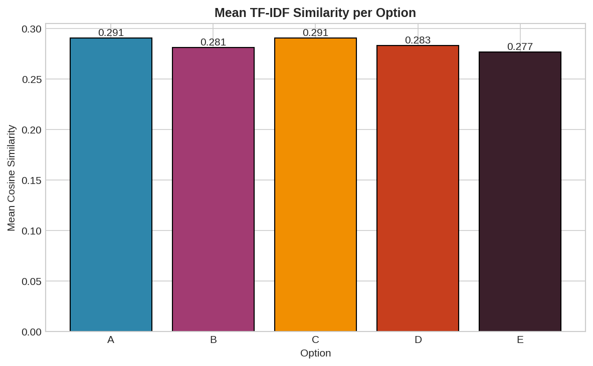

**Observation**

* Average prompt-option cosine similarity is very similar across all answer choices.
* Options **A** and **C** have marginally higher similarity.
* TF-IDF alone provides little discrimination between correct and incorrect answers.

---

## 5. Mean Word2Vec Similarity per Option

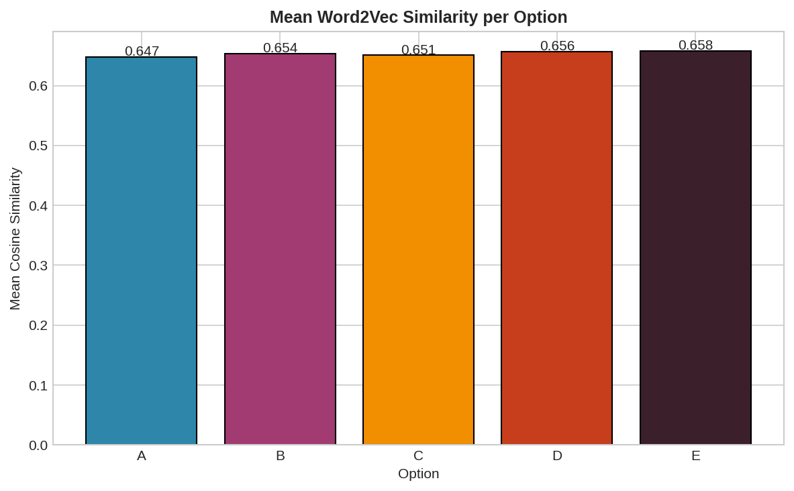

**Observation**

* Word2Vec produces generally higher similarity scores than TF-IDF.
* Option **E** has the highest average similarity.
* Differences between options remain small, limiting predictive usefulness.

---

## 6. Rank Distribution

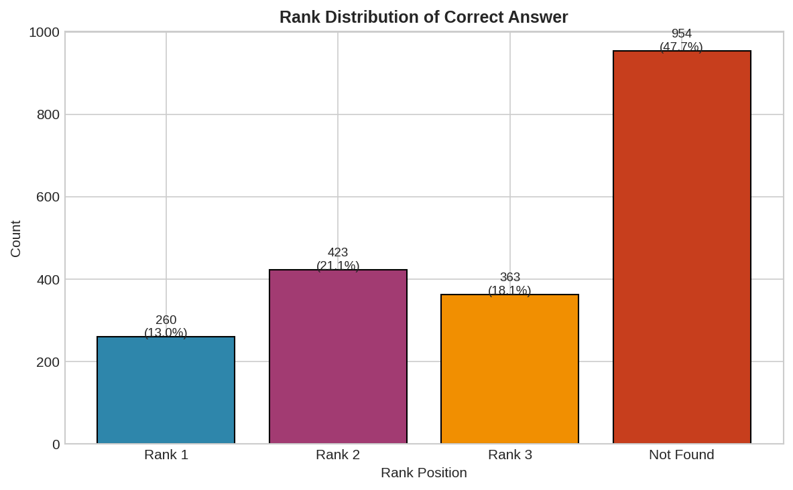

**Observation**

* Shows where the correct answer appears in similarity-based rankings.
* Only about **13%** of correct answers are ranked first.
* Nearly **48%** of correct answers do not appear within the top three predictions.

---

## 7. Text Length Distribution

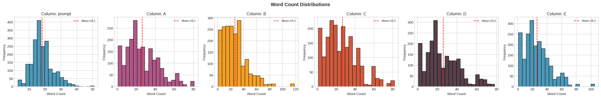

**Observation**

* Prompts average roughly **18 words**.
* Answer options average **26–27 words**.
* Option texts exhibit greater variability than prompts.

---

## 8. Most Frequent Prompt Words

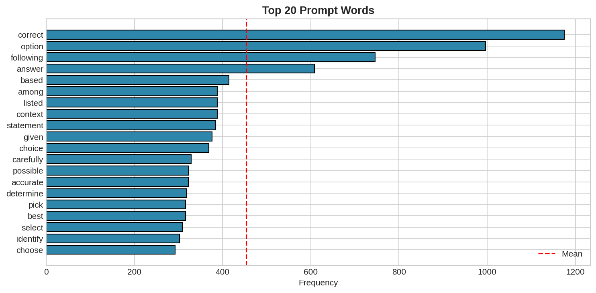

**Observation**

* Frequently occurring words include:

  * correct
  * option
  * following
  * answer
  * based
  * statement
  * context

* These indicate that prompt text primarily consists of instructional MCQ language.

---

## 9. Most Frequent Option Words

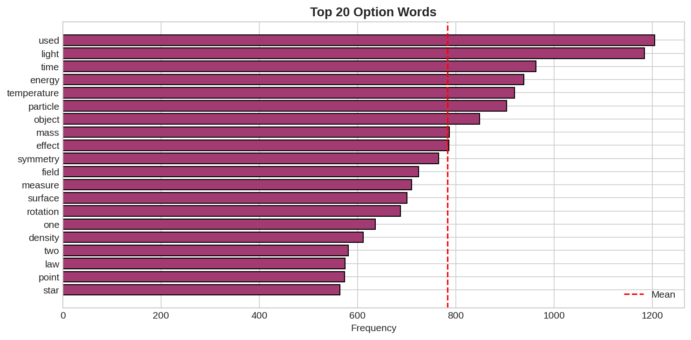

**Observation**

* Frequently occurring words include:

  * energy
  * temperature
  * particle
  * mass
  * density
  * law
  * rotation
  * surface

* The options are largely composed of scientific and technical terminology.

---

## 10. Word2Vec PCA Visualization

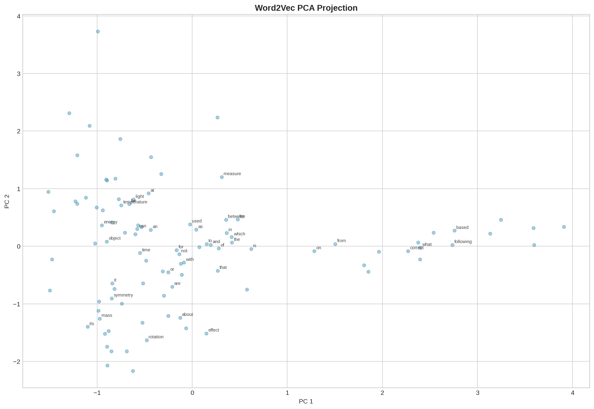

**Observation**

* PCA projects Word2Vec embeddings into two dimensions.
* Semantically related scientific terms cluster together.
* Instructional prompt words occupy different regions than domain-specific vocabulary.

---

## 11. TF-IDF Similarity Distribution

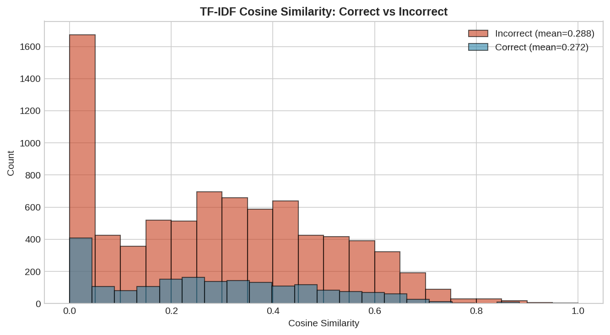

**Observation**

* Similarity distributions for correct and incorrect answers overlap heavily.
* Incorrect options exhibit a slightly higher average similarity than correct answers.
* TF-IDF cosine similarity alone is not a reliable ranking signal.

---

## 12. Word2Vec Similarity Distribution

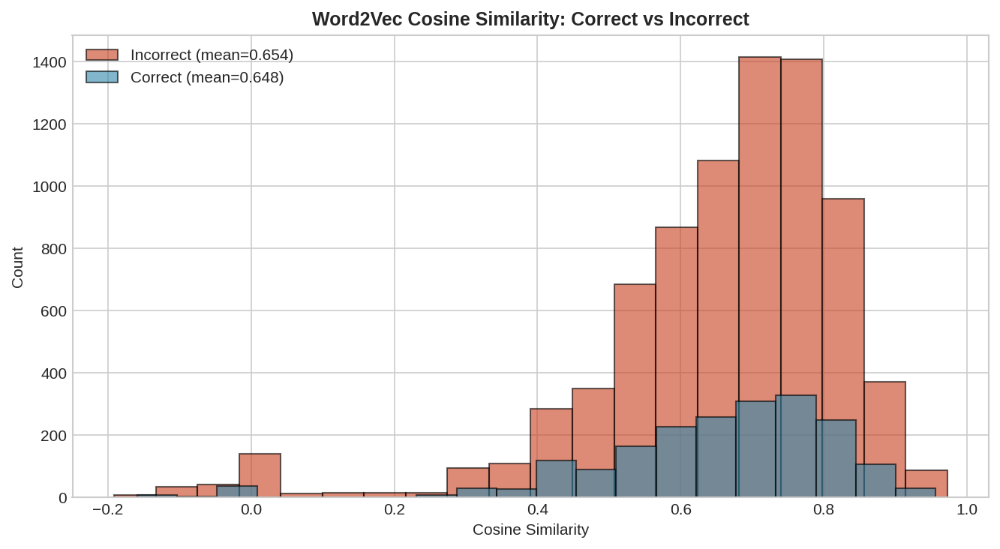

**Observation**

* Similar overlap exists for Word2Vec similarities.
* Incorrect options again have a marginally higher average similarity.
* Word2Vec embeddings alone do not effectively distinguish correct answers.

---

# Key Findings

* The dataset has only mild answer-label imbalance.
* Prompts contain mostly instructional language, whereas answer options contain domain-specific terminology.
* Different answer options frequently share similar vocabulary, making similarity-based ranking difficult.
* TF-IDF and Word2Vec similarity scores provide weak separation between correct and incorrect answers.
* Baseline ranking strategies outperform both similarity-based approaches, suggesting lexical similarity alone is insufficient for solving the task.

---

# Conclusion

The exploratory analysis indicates that traditional semantic similarity methods such as TF-IDF and Word2Vec are not strong predictors of the correct answer in this dataset. Their similarity distributions overlap substantially for correct and incorrect options, resulting in poor ranking performance.

These findings motivate the use of more expressive embedding models (e.g., Sentence Transformers) and supervised learning approaches capable of capturing deeper semantic relationships beyond surface-level lexical similarity.
