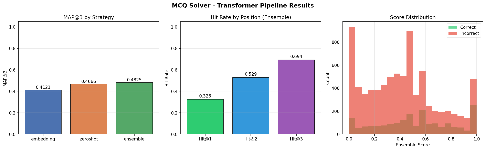

# Milestone 2 Report
# Transformer-Based Semantic MCQ Solver using SBERT + Zero-Shot NLI

**Course:** Deep Learning & Generative AI  
**Project:** Smart MCQ Solver Challenge  
**Student:** Mujahedul Islam Makhdumi Hisamuddin  
**Models Used:**
- Sentence-BERT (`sentence-transformers/all-MiniLM-L6-v2`)
- Zero-Shot NLI (`typeform/distilbert-base-uncased-mnli`)

---

# Objective

The objective of this milestone was to replace traditional machine learning methods with transformer-based semantic models capable of understanding the meaning of both the question and answer choices.

Instead of relying on handcrafted features or TF-IDF vectors, this pipeline leverages pretrained transformer models to compute semantic similarity and textual entailment between the prompt and each candidate option.

An ensemble of both approaches was then evaluated using the MAP@3 metric.

---

# Pipeline Overview

The complete transformer pipeline consists of the following stages:

1. GPU Initialization
2. Weights & Biases (W&B) Setup
3. Data Loading
4. Transformer Model Loading
5. Smoke Testing
6. Semantic Scoring
7. Prediction Generation
8. MAP@3 Evaluation
9. Strategy Comparison
10. Submission File Generation

---

# Environment Configuration

## Hardware

| Component | Value |
|-----------|-------|
| GPU | Tesla T4 ×2 |
| GPU Memory | 15.6 GB each |
| CUDA Version | 12.8 |
| Compute Capability | 7.5 |

## Software

| Library | Version |
|----------|---------|
| PyTorch | 2.10.0 |
| CUDA Support | Enabled |
| Device Used | CUDA |

The pipeline successfully detected CUDA-compatible hardware and executed inference entirely on GPU.

---

# Experiment Tracking

Weights & Biases (W&B) was integrated for experiment tracking.

The following were logged:

- Training metrics
- MAP@3
- Hit@K metrics
- Runtime statistics
- Submission artifact
- Strategy comparison
- Performance plots

Run Name:

```
transformer-embeddings-zeroshot
```

---

# Dataset

## Training Set

- Samples: **2,000**
- Columns: **26**

Features include:

- Prompt
- Five answer choices
- Correct answer
- Cleaned text
- Character length
- Word length

### Answer Distribution

| Option | Count |
|---------|------:|
| A | 369 |
| B | 490 |
| C | 459 |
| D | 358 |
| E | 324 |

The dataset is reasonably balanced across all answer classes.

---

## Test Set

- Samples: **500**
- Columns: **25**

The processed datasets were also saved for future reuse.

---

# Transformer Models

## 1. Sentence-BERT

Model:

```
sentence-transformers/all-MiniLM-L6-v2
```

Embedding Size:

```
384 dimensions
```

Purpose:

- Generate semantic embeddings for prompts and answer options.
- Compute cosine similarity between prompt and each candidate answer.
- Rank options based on semantic closeness.

---

## 2. Zero-Shot NLI

Model:

```
typeform/distilbert-base-uncased-mnli
```

Purpose:

Treat every answer option as a hypothesis and determine how strongly the prompt entails that option.

Output labels:

- Entailment
- Neutral
- Contradiction

Only entailment probabilities were used as semantic confidence scores.

---

# Smoke Testing

Before executing the full pipeline, both models were validated on a single sample.

### Embedding Model

Successfully generated similarity scores for all five options.

### Zero-Shot Model

Successfully generated entailment probabilities.

Both models selected the correct option during smoke testing, confirming that the pipeline was functioning correctly before large-scale inference.

---

# Semantic Scoring Pipeline

The pipeline computed scores using two independent semantic approaches.

## Embedding Strategy

For every MCQ:

- Encode prompt
- Encode all five options
- Compute cosine similarity
- Rank options

Processing time:

- Train: **9.8 seconds**
- Test: **2.2 seconds**

---

## Zero-Shot Strategy

For every question:

Each answer option was evaluated independently using Natural Language Inference.

Processing time:

- Train: **25.7 seconds**
- Test: **6.3 seconds**

Although slower than embeddings, this strategy captures deeper semantic reasoning.

---

# Ensemble Strategy

The final prediction combined both transformer models.

The ensemble leverages:

- semantic similarity from SBERT
- logical entailment from NLI

This improves robustness by reducing dependence on any single scoring mechanism.

---

# Evaluation Metric

The project uses:

## MAP@3 (Mean Average Precision @ 3)

Instead of requiring the correct answer to be ranked first, MAP@3 rewards predictions when the correct answer appears anywhere within the top three ranked choices.

This metric is particularly suitable for multiple-choice retrieval tasks.

---

# Results

## Overall Performance

| Metric | Value |
|---------|------:|
| MAP@3 | **0.4825** |
| Hit@1 | **0.3260** |
| Hit@2 | **0.5290** |
| Hit@3 | **0.6940** |

Correct predictions:

| Position | Count |
|----------|------:|
| Top-1 | 652 |
| Top-2 | 406 |
| Top-3 | 330 |

Total Questions:

```
2000
```

---

# Strategy Comparison

| Strategy | MAP@3 | Hit@1 | Hit@2 | Hit@3 |
|-----------|------:|------:|------:|------:|
| Embedding | 0.4121 | 0.2595 | 0.4370 | 0.6285 |
| Zero-Shot | 0.4666 | 0.3080 | 0.5015 | 0.6870 |
| **Ensemble** | **0.4825** | **0.3260** | **0.5290** | **0.6940** |

---

# Performance Analysis

The transformer ensemble consistently outperformed both standalone approaches.

## Improvements over Embedding

| Metric | Improvement |
|---------|------------:|
| MAP@3 | +0.0704 |
| Hit@1 | +6.65% |
| Hit@2 | +9.20% |
| Hit@3 | +6.55% |

---

## Improvements over Zero-Shot

| Metric | Improvement |
|---------|------------:|
| MAP@3 | +0.0159 |
| Hit@1 | +1.80% |
| Hit@2 | +2.75% |
| Hit@3 | +0.70% |

Although the gain over Zero-Shot is modest, the ensemble consistently achieves the best performance across all evaluation metrics.

---

# Visualization Summary

The generated performance plots provide further insight into model behavior.

### MAP@3 Comparison

- Embedding: **0.4121**
- Zero-Shot: **0.4666**
- Ensemble: **0.4825**

The ensemble achieved the highest MAP@3 score.

---

### Hit Rate

- Hit@1 = **32.6%**
- Hit@2 = **52.9%**
- Hit@3 = **69.4%**

Nearly 70% of the questions contain the correct answer within the top three predictions.

---

### Score Distribution

The score histogram illustrates the distribution of confidence scores for correct and incorrect predictions.

Correct answers generally receive higher ensemble confidence scores, indicating that the combined model effectively separates correct options from incorrect ones.

---
# Performance Visualization

The following figure summarizes the overall performance of the transformer-based MCQ solver. It compares the individual transformer strategies (Sentence-BERT and Zero-Shot NLI) against the proposed ensemble model, presents the hit rate at different prediction positions, and visualizes the confidence score distribution.

<div align="center">



**Figure 1:** Performance comparison of the transformer-based MCQ solver. The left chart compares MAP@3 across the Embedding, Zero-Shot, and Ensemble strategies. The middle chart shows Hit@1, Hit@2, and Hit@3 for the ensemble model, demonstrating that the correct answer appears within the top three predictions for **69.4%** of the training samples. The right histogram illustrates the distribution of ensemble confidence scores for correct and incorrect predictions, showing that correct answers generally receive higher confidence scores.

</div>

## Observations

- The **Ensemble** strategy achieved the highest **MAP@3 score (0.4825)**, outperforming both standalone transformer models.
- **Zero-Shot NLI** performed better than the SBERT embedding model, indicating that textual entailment provides stronger semantic reasoning for MCQ answering.
- The ensemble improved ranking performance by combining semantic similarity with natural language inference.
- The **Hit@3 value of 69.4%** indicates that nearly seven out of ten questions have the correct answer within the top three predicted options.
- The score distribution demonstrates better separation between correct and incorrect predictions, suggesting that the ensemble assigns higher confidence to correct answers.
- Overall, the visualization confirms that combining multiple transformer-based semantic models results in more accurate and reliable MCQ ranking than using either model individually.

---
# Submission Generation

After evaluation:

- Top-3 predictions were generated for every test question.
- Submission format was validated.
- Final file saved as:

```
submission.csv
```

Total predictions:

```
500 questions
```

Each row contains exactly three ranked answer choices.

---

# Runtime

| Stage | Time |
|--------|------|
| Complete Pipeline | **66.1 seconds** |
| Model Evaluation | **59.0 seconds** |

GPU acceleration significantly reduced transformer inference time.

---

# Key Achievements

- Successfully implemented a fully transformer-based semantic MCQ solver.
- Utilized Sentence-BERT embeddings for semantic similarity.
- Integrated Zero-Shot Natural Language Inference for reasoning-based scoring.
- Designed an ensemble strategy combining both transformer outputs.
- Achieved a final **MAP@3 score of 0.4825**, outperforming the individual models.
- Generated a valid Kaggle submission with top-3 ranked predictions.
- Logged metrics, artifacts, and visualizations using Weights & Biases for experiment reproducibility.

---

# Conclusion

This milestone demonstrates the effectiveness of transformer-based semantic understanding for multiple-choice question answering. While individual models such as Sentence-BERT and Zero-Shot NLI performed competitively, combining their strengths through an ensemble yielded the best overall performance.

The final ensemble achieved a **MAP@3 score of 0.4825** and a **Hit@3 rate of 69.4%**, showing that semantic similarity and natural language inference complement each other in ranking correct answers. GPU acceleration and W&B integration further ensured efficient execution and reproducible experimentation.

This work establishes a strong transformer-based baseline for future improvements, such as fine-tuning domain-specific language models, optimizing ensemble weighting, and incorporating cross-encoder architectures to further enhance MCQ prediction accuracy.